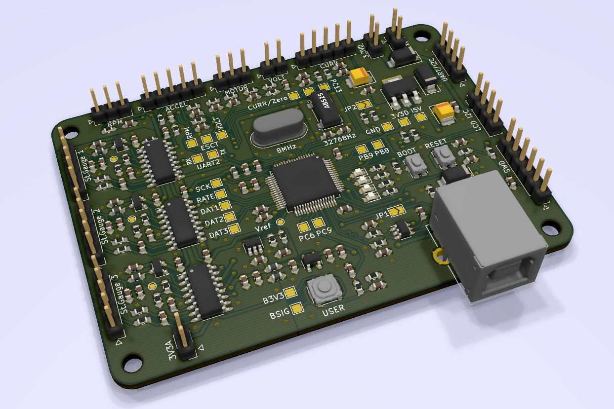
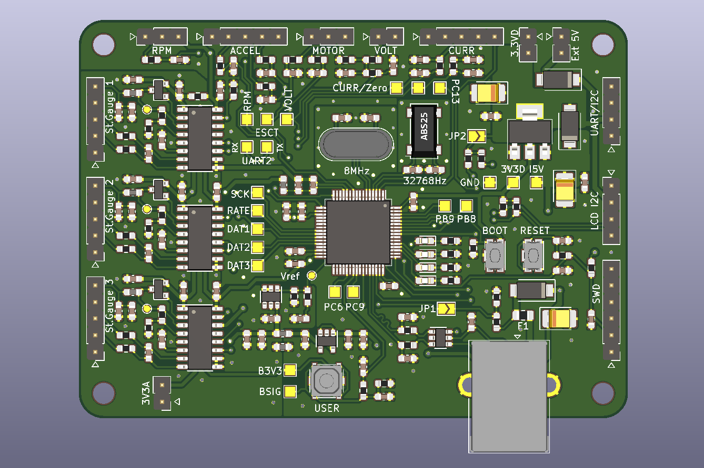
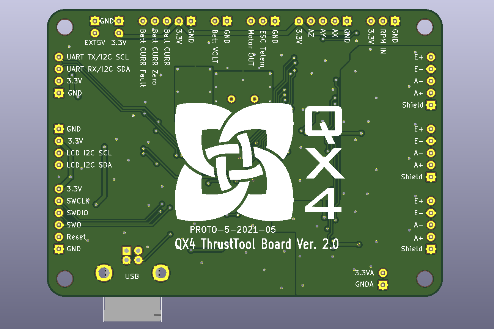
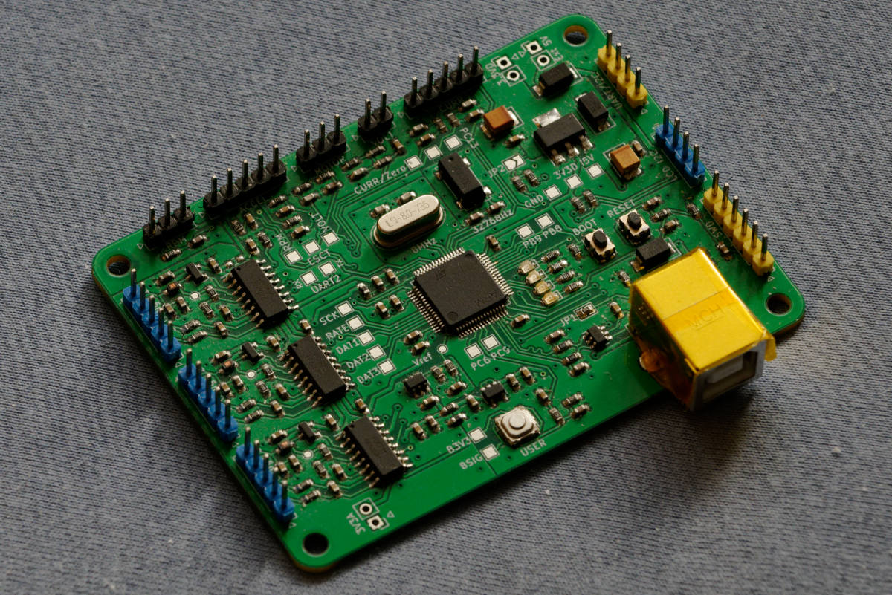

## Custom board - thrustBoard v2

Custom measurement board (thrustBoard v2) is based on STM32 F401RETx LQFP64 MCU. 
The schematic of the thrustBoard v2 is [here](../Board/thrust_v2.pdf).

### Main features of the board:
* the physical board size is 84mm x 61mm.
* 3x channels of HX711 (24-Bit ADC for weight scales) - only 2 of them are actually used
* 8x 12-Bit ADC built-in inside the MCU used for battery voltage, current (2 channels), reference voltage, analog accelerometer (3 channels), MCU temperature
* SWD interface used for programming and debugging
* 1x UART or I2C communication for some future use
* 1x LCD with I2C interface to show some diagnostic data
* USB used communication with the board
* the board is powered by the USB but it is also possible use external 5V power source
* reset button, boot button (not used since programming is done by SWD), user button (currently not used in firmware)

### Recommended parts to use with the board:
* [Current sensors base on Hall sensor](https://www.pololu.com/category/118/current-sensors);
  some sensor require two channels of ADC one for current measurement and another for zero current
* ESC motor controller with telemetry (allows to obtain RPMs without additional infrared sensor), 
  e.g., [Tekko32 F3 Metal ESC (65A)](http://www.holybro.com/product/tekko32-f3-metal-esc-65a/)

### Additional notes:
- JP1 when closed allows to use USB_VBUS
- JP2 when closed enables pull-up resistor when UART/I2C is used as I2C 
- RTC crystal is not really currently needed. It was added for some possible future ideas.

### Front and back of the thrustBoard v2:

### Note

It is possible to use standard STM32 Nucleo F401RE board equipped with additional HX711 sensor boards instead of the thrustBoard v2.
Such approach require some experimenting both with hardware and firmware in order to map the pins, etc., properly.

### Picture of the board:

