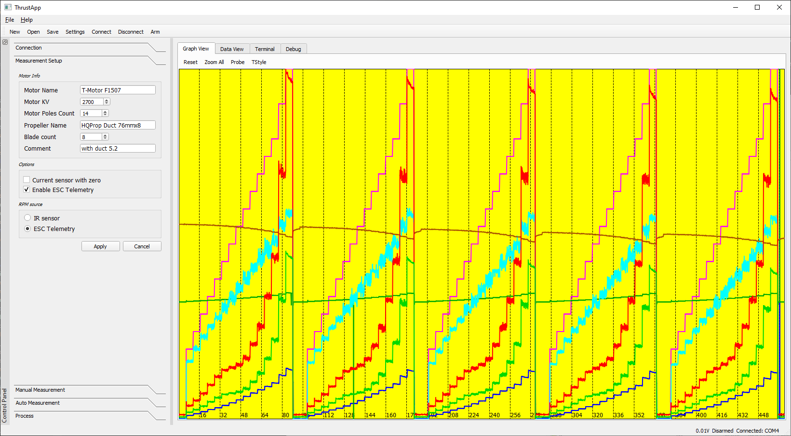

## ThrustApp 

ThrustApp is a QT application used conducting measurement (tested in Win10 environment). 
It connects to measurement board and using serial protocol manages the process of data acquisition, receives the data
and present it in visual or tabular form. Finally it can processes the data and export a measurement report.

### Example view of the ThrustApp

### Short description

The app is split in two areas: left is for controlling and right is for data presenting, terminal and protocol debugging.

Control widgets (for details see Workflow):
* Connection
* Measurement Setup
* Manual Measurement - allows to manually start/stop data acquisition and start/stop motor with given output level (in micro-seconds)
* Auto Measurement
* Process

Main widgets:
* Graph View - shows data as a graph of multiple channels, both __raw__ and __cooked__. 
  It is possible to select what is shown by TStyle dialog (press 'Color' to choose color, line style). 
  Ctrl+click can be used for zoom-window or Ctrl+wheel for zoom-in and zoom-out.
* Data View - shows data as a simple tabular array. Some column can be hidden for clarity
* Terminal - is used for low level connection to measurement board
* Debug - used for protocol debugging

### Workflow

* Connect to the tool via USB (the port should be visible as STMicroelectronics Virtual COM Port).
  Acceptable baud rate should be up to 500000. After successful connection info about board and firmware can be found in Help/About 
  and status bar should display 'Connected: COMx'.
* In 'Measurement Setup' put information about motor/propeller (needed only for reports) and select options. The tested options are 
  'ESC Telemetry' and 'Enable ESC Telemetry'. Then press apply
* Select 'Auto Measurement' and press button 'Auto Create'. Choose starting and ending level and increment of motor output, 
  provide number of samples per single measurement (e.g., around 55-60 when using 10smpl/s) and 
  number of samples between measurements with motor output level 0% (preferably it should be 0). 
  After accepting the measurement table will be filled with values. You can still add or remove rows by mouse right-click menu.  
* Execute measurement setup by arming motor (main toolbar 'Arm') and pressing button 'Measure Start'.
  Measurements can be repeated however with every measurement the battery voltage is dropping affecting the final results.
* Final step is processing data. The 'Left margin' (e.g., around 10) and 'Right margin' (e.g., around 4) 
  allows to select which part of single measurement is taken into account. This is necessary due to instabilities or delays with motor 
  response after changing the output level. The zero level is estimated taking into account all measurements with output level 0%.
* A report can be generated by choosing 'File/Export' from menu. The report can exported as a text report
  (which contains only arrays of measurements) or as a latex file (can show also the plots). Before generating latex report, first
  the report template must be chosen ('File/Select Latex template')

