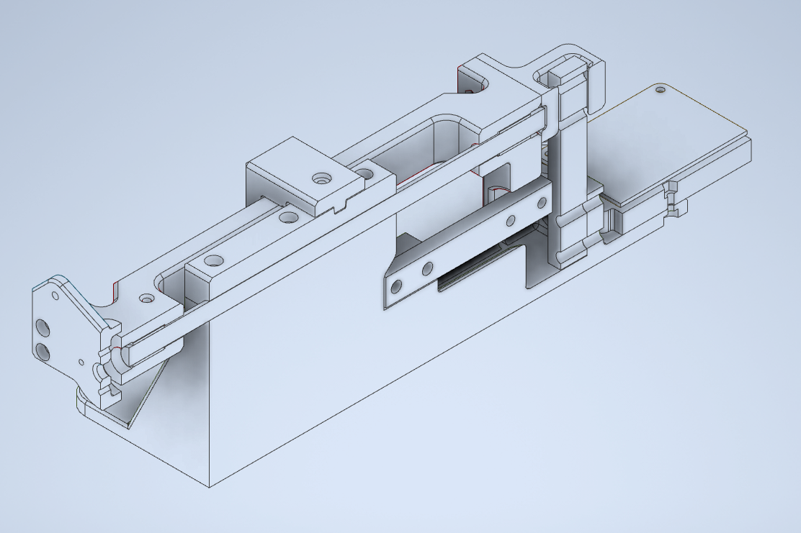

## Tool (3D printed)

The tool is built around two load cells: first for thrust and second for torque measurement. 
I have used load cells: 1kG for torque and 2kG for thrust - they allow measurements with resolution around 0.1G for thrust and 0.25 Gcm for torque.
The propeller should be mounted as a pusher such that flow stream behind propeller is not interacting with the tool and remain undisturbed.

### Half section of the tool:

### 3D-printed parts:
printed using PLA and without any support:
* stand
* axle mount
* spindle - use 4 perimeters
* thrust adapter
* lock - used to protect the load cells against excessive forces during, ex. transportation
* board mount
* motor mount - this part should be designed according to the motor specification, with or without infrared RPM sensor. 
  In case motor gets hot, more thermal resistant material should be used (PETG or even better ABS).

### Other elements:
* metal rod 8mm x 200mm
* [2 x plain bearing 8mm/10mm x 12mm](https://www.tme.eu/pl/en/details/wsm-0810-12/plain-bearings/igus/)
* M3 screws and nuts (length: 25mm, 16mm)

### extra 3D-printed parts:
they are not necessary but can be helpful during calibration process:
* thrust calib tray
* torque calib arm
