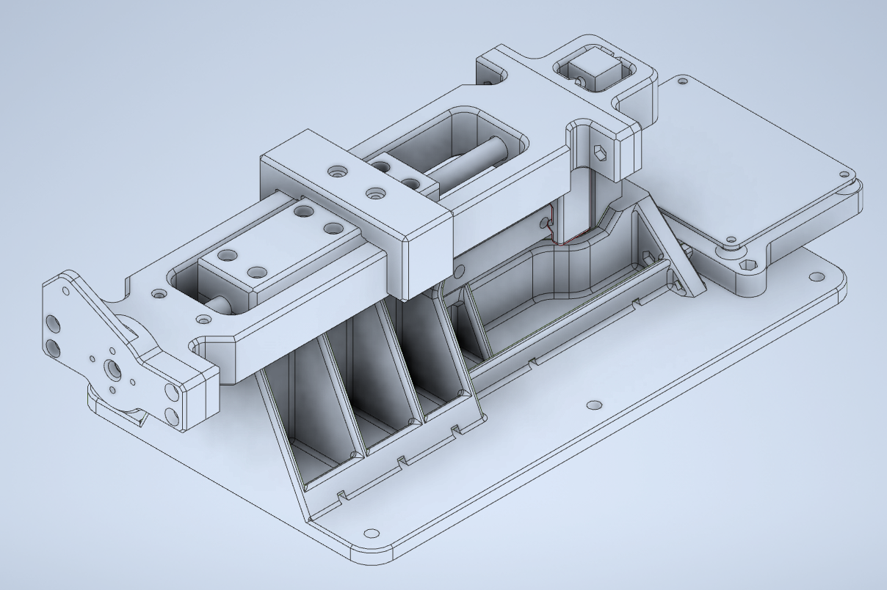

# ThrustTool #

The ThrustTool is a DIY tool for measurements of an electric motor with propeller.
It allows to measure thrust, torque, rotation speed, battery voltage and current.

The project includes:
* the 3d-printed tool 
* custom board using STM32 F401 mcu with HX711 for measurements of load cells
* firmware for the custom board 
* QT application for measurement managing and reporting.

### Board

Custom measurement board using STM32 F401 microcontroler
HX711 - 24-Bit Analog-to-Digital Converter (ADC) for Weigh Scales
12-bit microcontroler ADC used for measurements

### Firmware

Using ChibiOS

### Tool (3D print)

### ThrustApp 

QT application for conducting measurement (tested in Win10 environment)

## Warning ##

The project is delivered as is. All resposibilities lies on the side on the user. Remember to take adequate security measures when testing any motor (espacially powerful one).

